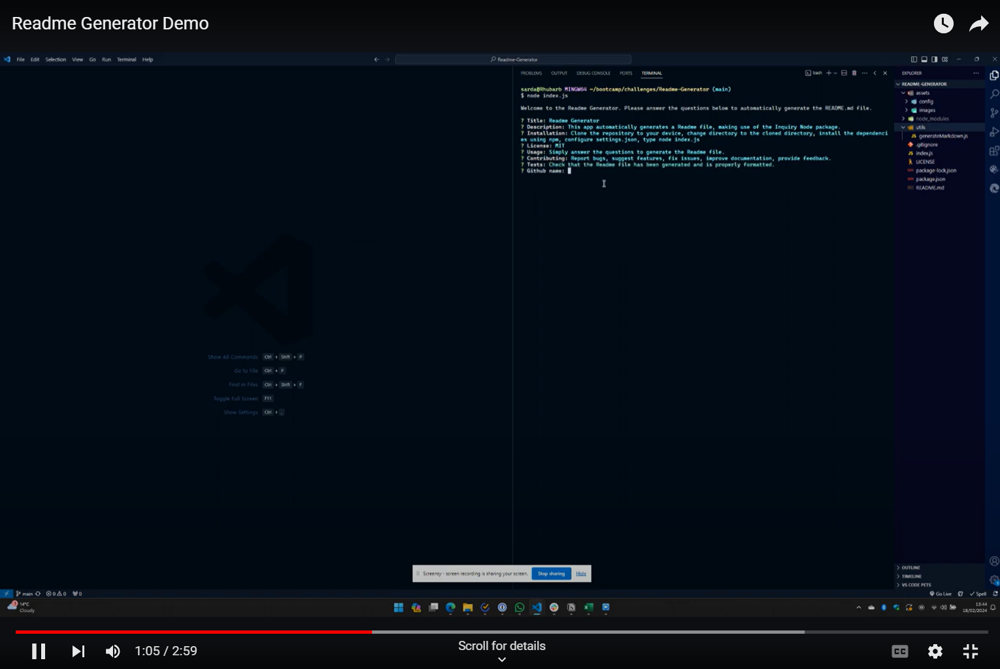

[](https://opensource.org/licenses/MIT)

# Readme Generator

## Table of Contents

[Description](#description)

[Screenshot](#screenshot)

[Installation](#installation)

[Usage](#usage)

[License](#license)

[Contributing](#contributing)

[Tests](#tests)

[Resources Referenced](#resources-referenced)

[Questions](#questions)

## Description

This application creates a Readme file based on input provided by the user. Node.js and Inquirer are used to achieve this.

## Video

Click on the image to play the video. Note: this will open directly in YouTube. Alternatively, you can download and play the video in the assets\video folder.

[](https://youtu.be/IAIQ-gJUBt4)

## Installation

1. Clone the repository to your device.
2. Change directory to the cloned directory.
3. Install the dependencies using npm.
4. Configure the name of your output file in [settings.json](./assets/config/settings.json)
5. From the command line, run the following command:

    ```console
    node index.js
    ```

## Usage

1. Follow the installation instructions above.
2. Simply answer the questions to generate the Readme file. See video for more details if needed.

## License

This application is covered under the following license: **Academic Free License v3.0**.

## Contributing

1. Report bugs.
2. Suggest features.
3. Fix issues.
4. Improve documentation.
5. Provide feedback.

## Tests

1. sampleREADME.md is created if it doesn't exist.
2. Values provided by the user are correctly displayed in the sample Readme file.

## Resources Referenced

- https://www.markdownguide.org/basic-syntax/
- https://www.makeareadme.com/
- https://www.w3schools.com/nodejs/nodejs_filesystem.asp
- https://stackoverflow.com/questions/11948245/markdown-to-create-pages-and-table-of-contents
- https://www.npmjs.com/package/inquirer
- https://docs.github.com/en/repositories/managing-your-repositorys-settings-and-features/customizing-your-repository/licensing-a-repository
- https://shields.io/badges
- https://www.freecodecamp.org/news/how-to-write-a-good-readme-file/
- https://www.geeksforgeeks.org/node-js-fs-readfilesync-method/
- https://www.w3schools.com/jsref/jsref_try_catch.asp
- https://stackoverflow.com/questions/11868512/linking-using-relative-path-on-github-readme-md

## Questions

Please contact me if you have any questions. You can also find my portfolio of work on [Github](https://github.com/ad).