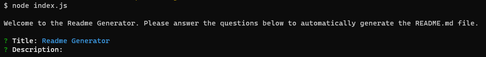

# Readme Generator

## Table of Contents

[Description](#description)

[Screenshot](#screenshot)

[Installation](#installation)

[Usage](#usage)

[License](#license)

[Contributing](#contributing)

[Tests](#tests)

[Questions](#questions)

## Description

This app automatically generates a Readme file, making use of the Inquiry Node package.

## Screenshot

## Installation

Clone the repository to your device, change directory to the cloned directory, install the dependencies using npm, configure settings.json, type node index.js

## Usage

Simply answer the questions to generate the Readme file.

## License

This application is covered under the following license: **MIT**.

## Contributing

Report bugs, suggest features, fix issues, improve documentation, provide feedback.

## Tests

Check that the Readme file has been generated and is properly formatted.

## Questions

Please contact me via email sardar.jafari@gmail.com if you have any questions. You can also find my portfolio of work on [Github](https://github.com/046159).